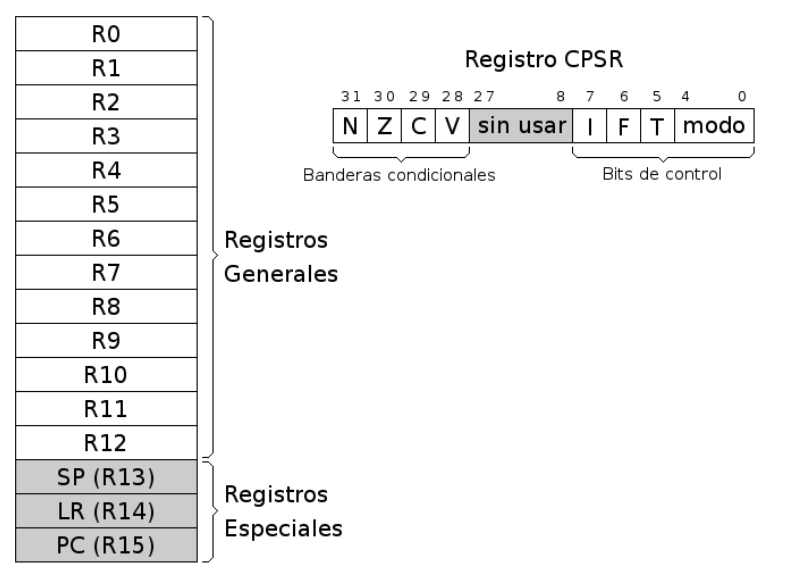

# ARM32
ARM es una arquitectura RISC (Reduced Instruction Set Computer=Ordenador con Conjunto Reducido de Instrucciones) de 32 bits.

## Assembly
El ensamblador es un lenguaje de bajo nivel que permite un control directo de la CPU y todos los elementos asociados. Cada línea de un programa ensamblador consta de una instrucción del procesador y la posición que ocupan los datos de esa instrucción.

## Registros

La arquitectura ARMv6 presenta un conjunto de 17 registros (16 principales más uno de estado) de 32 bits cada uno.

 

| Registros             | Descripcion |
| --------------------- | ----------- |
| Registros Generales   | Su función es el almacenamiento temporal de datos. Son los 13 registros que van R0 hasta R12.      |
| Registros Especiales  | Son los últimos 3 registros principales: R13, R14 y R15. SP/R13. |
|Registro CPSR          | Almacena las banderas condicionales y los bits de control. Los bits de control definen la habilitación de interrupciones normales (I), interrupciones rápidas (F), modo Thumb (T) y el modo de operación de la CPU.        |

| Registro especial  | Description |
| ------------------ | ----------- |
| SP/R13    	     | Stack Pointer ó Puntero de Pila. Sirve como puntero para almacenar variables locales y registros en llamadas a funciones.              |
| LR/R14    	     | Link Register ó Registro de Enlace. Almacena la dirección de retorno cuando una instrucción BL ó BLX ejecuta una llamada a una rutina. |
| PC/R15    	     | Program Counter ó Contador de Programa. Es un registro que indica la posición donde está el procesador en su secuencia de instrucciones. Se incrementa de 4 en 4 cada vez que se ejecuta una instrucción, salvo que ésta provoque un salto.        |

## Estructura codigo assembly

```assembly
.data

var1:    .word 3
var2:    .word 4
var3:    .word 0x1234

.text
.global main

main:    ldr    r1, puntero_var1    /* r1 <- & var1    */
         ldr    r1, [r1]            /* r1 <- *r1       */
         ldr    r2, puntero_var2    /* r2 <- & var2    */
         ldr    r2, [r2]            /* r2 <- *r2       */
         ldr    r3, puntero_var3    /* r3 <- & var3    */
         add    r0, r1, r2          /* r0 <- r1 + r2   */
         str    r0, [r3]            /* *r3 <- r0       */
         bx     lr
         
puntero_var1:   .word   var1
puntero_var2:   .word   var2
puntero_var3:   .word   var3
```

**Sección de datos.** Viene identificada por la directiva .data. En esta zona se definen todas las variables que utiliza el programa con el objeto de reservar memoria para contener los valores asignados. <br>

**Sección de código.** Se indica con la directiva .text, y sólo puede contener código o datos no modificables. <br>

**Datos.**
Los datos se pueden representar de distintas maneras. Para representar números tenemos 4 bases. La más habitual es en su forma decimal, la cual no lleva ningún delimitador especial. Luego tenemos otra muy útil que es la representación hexadecimal, que indicaremos con el prefijo 0x. Otra interesante es la binaria, que emplea el prefijo 0b antes del número en binario. La cuarta y última base es la octal, que usaremos en raras ocasiones y se especifica con el prefijo 0.

**Simbolos.**
En la zona de datos, las etiquetas pueden representar variables, constantes y cadenas. En la zona de código podemos usar etiquetas de salto, funciones y punteros a zona de datos. Las macros y las constantes simbólicas son símbolos cuyo ámbito pertenece al preprocesador, a diferencia de las etiquetas que pertenecen al del ensamblador. Se especifican con las directivas .macro y .equ respectivamente y permiten que el código sea más legible y menos repetitivo.

**Instrucciones.**
```
Etiqueta : Nemotécnico Operando/s /* Comentario */

main : ldr r1, puntero_var1 /* r1 <- & var1 */
```
*Campo etiqueta*: si aparece, debe estar formado por una cadena alfanumérica. <br>
*Campo Nemotécnico*: es una forma abreviada de nombrar la instrucción del procesador. <br>
*Campo Operando/s*: indica dónde se encuentran los datos. Puede haber 0, 1 ó más operandos en una instrucción. <br>

**Directivas.**
Las directivas son expresiones que aparecen en el módulo fuente e indican al compilador que realice determinadas tareas en el proceso de compilación. Son fácilmente distinguibles de las instrucciones porque siempre comienzan con un punto.


# Instalar gcc multilib de ser necesario
Si al compilar codigo c a assembly con el comando siguiente y al tratar de correr el archivo .s marca error:
```bash
$ gcc -Os -S -o evodd.s evodd.c
$ as -o evodd.o evodd.s
$ ld -o evodd  evodd.o
$ ./evodd
```

Instalar gcc multilib para poder compilar correctamente a 32-bit:
```bash
sudo apt-get install gcc-multilib g++-multilib
```

# Ejemplo codigo C y Assembly

 

```c
#include <stdio.h>

int main(){
    for (int i = 0; i < 10; i++){
        if(i&1)
	   printf("%d es impar\n", i);
        else
	   printf("%d es par\n", i);
    }
    return 0;
}
```

```bash
#Convertir a assembly
pi@raspberrypi:~/arm32 $ g++ -S evodd.c
```


```assembly
	.arch armv6
	.eabi_attribute 28, 1
	.eabi_attribute 20, 1
	.eabi_attribute 21, 1
	.eabi_attribute 23, 3
	.eabi_attribute 24, 1
	.eabi_attribute 25, 1
	.eabi_attribute 26, 2
	.eabi_attribute 30, 6
	.eabi_attribute 34, 1
	.eabi_attribute 18, 4
	.file	"evodd.c"
	.text
	.section	.rodata
	.align	2
.LC0:
	.ascii	"%d es impar\012\000"
	.align	2
.LC1:
	.ascii	"%d es par\012\000"
	.text
	.align	2
	.global	main
	.arch armv6
	.syntax unified
	.arm
	.fpu vfp
	.type	main, %function
main:
	.fnstart
.LFB0:
	@ args = 0, pretend = 0, frame = 8
	@ frame_needed = 1, uses_anonymous_args = 0
	push	{fp, lr}
	.save {fp, lr}
	.setfp fp, sp, #4
	add	fp, sp, #4
	.pad #8
	sub	sp, sp, #8
	mov	r3, #0
	str	r3, [fp, #-8]
.L5:
	ldr	r3, [fp, #-8]
	cmp	r3, #9
	bgt	.L2
	ldr	r3, [fp, #-8]
	and	r3, r3, #1
	cmp	r3, #0
	beq	.L3
	ldr	r1, [fp, #-8]
	ldr	r0, .L7
	bl	printf
	b	.L4
.L3:
	ldr	r1, [fp, #-8]
	ldr	r0, .L7+4
	bl	printf
.L4:
	ldr	r3, [fp, #-8]
	add	r3, r3, #1
	str	r3, [fp, #-8]
	b	.L5
.L2:
	mov	r3, #0
	mov	r0, r3
	sub	sp, fp, #4
	@ sp needed
	pop	{fp, pc}
.L8:
	.align	2
.L7:
	.word	.LC0
	.word	.LC1
	.fnend
	.size	main, .-main
	.ident	"GCC: (Raspbian 8.3.0-6+rpi1) 8.3.0"
	.section	.note.GNU-stack,"",%progbits
```

# Output
```bash
#construir binarios 32-bit
pi@raspberrypi:~/arm32 $ gcc -g evodd.s -o evodd -mbe32
pi@raspberrypi:~/arm32 $ ./evodd
0 es par
1 es impar
2 es par
3 es impar
4 es par
5 es impar
6 es par
7 es impar
8 es par
9 es impar
```
